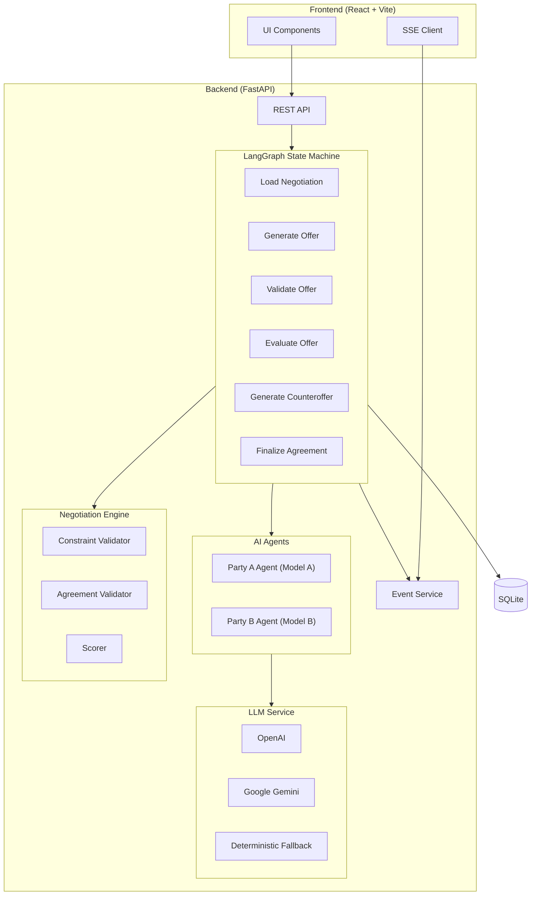
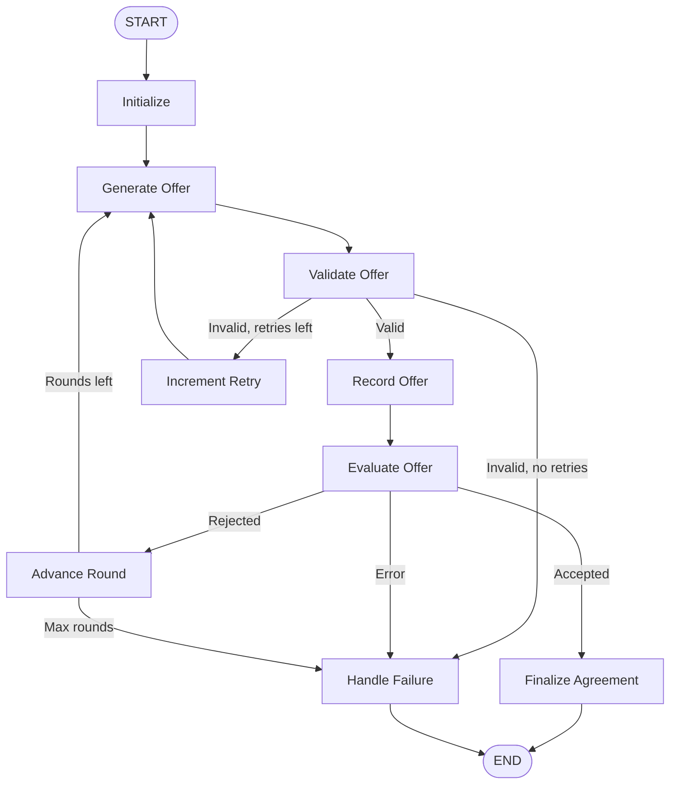

# FairStay — AI Negotiation Platform

> **Humans define their boundaries. AI negotiates within those boundaries.**

FairDeal is a multi-agent AI negotiation platform where two parties with conflicting interests are each represented by separate AI agents. Each agent receives its human's private preferences, constraints, and priorities — then negotiates over multiple rounds to reach a mutually acceptable agreement.

---

## 📋 Table of Contents

1. [What is FairDeal?](#what-is-fairdeal)
2. [Problem](#problem)
3. [Why AI is Necessary](#why-ai-is-necessary)
4. [Architecture](#architecture)
5. [LangGraph Flow](#langgraph-flow)
6. [How Agents Work](#how-agents-work)
7. [Private Information Model](#private-information-model)
8. [Constraint Validation](#constraint-validation)
9. [Failure Handling](#failure-handling)
10. [Evaluation Results](#evaluation-results)
11. [Cost Model](#cost-model)
12. [Local Setup](#local-setup)
13. [Environment Variables](#environment-variables)
14. [Demo Instructions](#demo-instructions)
15. [Known Limitations](#known-limitations)

---

## What is FairDeal?

FairDeal is a production-style MVP that demonstrates how AI agents can negotiate complex, multi-variable agreements on behalf of humans. The system:

- **Two separate AI agents** negotiate with each other, each using a different LLM when available
- **Private preferences** are enforced at the code level — agents never see the other party's constraints
- **Structured offers** (JSON/Pydantic) ensure every negotiation term is validated, not just free-form chat
- **Deterministic validation** wraps every LLM decision — the AI proposes, Python validates
- **Human approval** is required before any agreement is finalized
- **Fairness scoring** is calculated using deterministic algorithms, not AI

### Supported Scenarios

| Scenario | Parties | Variables |
|----------|---------|-----------|
| **Salary** | Candidate ↔ Employer | salary, joining bonus, remote days, annual bonus, notice period, equity |
| **Rental** | Tenant ↔ Landlord | monthly rent, deposit, lease duration, furnished, parking, maintenance |
| **Freelance** | Client ↔ Freelancer | total price, deadline, milestones, upfront payment, revisions, support |

The architecture is generic — new scenarios can be added by defining variables and seed preferences only.

---

## Problem

Real-world negotiations (salary, rent, contracts) involve:
- Multiple interdependent variables
- Private information and hidden constraints
- Emotional bias and fatigue
- Power imbalances

Humans often settle for suboptimal deals because they can't simultaneously optimize across all variables while managing the interpersonal dynamics of negotiation.

---

## Why AI is Necessary

Removing the AI from FairDeal would fundamentally change the product. The AI agents:

1. **Evaluate multi-variable tradeoffs** — consider all negotiation dimensions simultaneously
2. **Generate structured counteroffers** — propose specific terms with reasoning
3. **Adapt strategy over rounds** — increase concession urgency as deadline approaches
4. **Never reveal private information** — maintain perfect information asymmetry
5. **Never violate hard constraints** — backed by deterministic validation

Without AI, this would be a manual back-and-forth form exchange — the negotiation intelligence is the core product.

---

## Architecture



### Tech Stack

| Layer | Technology |
|-------|-----------|
| Backend | Python 3.11, FastAPI, Uvicorn |
| AI | LangChain, LangGraph |
| Database | SQLite + SQLAlchemy (async) |
| Frontend | React, Vite, Plain CSS |
| Live Updates | Server-Sent Events (SSE) |
| Containerization | Docker Compose |

---

## LangGraph Flow

The negotiation is modeled as a **LangGraph StateGraph** with explicit states and conditional edges:



State is managed using typed Pydantic-compatible `TypedDict` with append-only reducers for offers, events, and cost metrics.

---

## How Agents Work

Each negotiation creates two independent agent instances:

```
PartyAAgent (uses OpenAI / primary model)
PartyBAgent (uses Google Gemini / secondary model)
```

Each agent:
1. Receives **only its own** private preferences
2. Generates structured offers using `with_structured_output()`
3. Evaluates incoming offers against its own constraints
4. Makes concessions on lower-priority items first
5. Increases urgency as rounds approach the limit
6. Never proposes terms that violate its own hard constraints

### Dual Model Support

When both API keys are configured:
- Party A → OpenAI (e.g., `gpt-4o-mini`)
- Party B → Google Gemini (e.g., `gemini-3.6-flash`)

If only one key is available, both agents use that model. If no keys are configured, a **deterministic fallback agent** runs using rule-based heuristics.

---

## Private Information Model

**Critical security property**: Party A's preferences are NEVER sent to Party B's agent, and vice versa.

This is enforced at the **code level**, not just the prompt level:

```python
# In graph/nodes.py — each agent only receives its OWN preferences
def _get_agent(state, role):
    if role == "party_a":
        prefs = PartyPreferences(**state["party_a_preferences"])
        return PartyAAgent(name=..., preferences=prefs, ...)
    else:
        prefs = PartyPreferences(**state["party_b_preferences"])
        return PartyBAgent(name=..., preferences=prefs, ...)
```

The `NegotiationAgent.build_system_prompt()` method only includes the agent's own constraints, ideal values, and private information.

---

## Constraint Validation

The LLM decides **"what should I propose?"** — the application code decides **"is this legal?"**

```
Student max rent = ₹20,000
Agent proposes ₹22,000
→ ConstraintValidator rejects
→ Agent must regenerate (up to MAX_RETRIES)
```

Three deterministic validators:

| Validator | Purpose |
|-----------|---------|
| `ConstraintValidator` | Checks offer terms against hard constraints |
| `OfferValidator` | Validates structure, required fields, value ranges |
| `AgreementValidator` | Validates final agreement against BOTH parties |

---

## Failure Handling

| Failure | Handling |
|---------|----------|
| LLM API failure | Retry with exponential backoff (3 attempts) |
| Invalid JSON | Automatic retry via `with_structured_output()` |
| API timeout | Retry → fallback to alternate model |
| Impossible negotiation | Stop after MAX_ROUNDS with explanation |
| Conflicting constraints | Explain why no agreement is possible |
| Model hallucination | Deterministic validation rejects invalid offers |
| Network failure | State persisted in SQLite, negotiation can resume |
| All models fail | Deterministic fallback agent takes over |

---

## Evaluation Results

The evaluation harness (`python evaluate.py`) runs 20 test negotiations:

```
Test Categories:
- Easy agreements (overlapping ranges)
- Impossible agreements (non-overlapping constraints)
- Conflicting constraints
- Aggressive negotiators
- Flexible negotiators
- Firm vs firm
- Narrow overlap
- Max rounds edge cases
- Single round
- Mismatched priorities
```

Metrics reported:
- Agreement Success Rate
- Constraint Violation Rate
- Average Negotiation Rounds
- Average Latency
- Average Token Cost

---

## Cost Model

Every LLM call tracks:
- Input/output tokens (estimated)
- Estimated cost based on configured pricing
- Latency
- Model used

Cost estimates are clearly labeled as approximations based on:
- OpenAI: $0.15 / $0.60 per 1M input/output tokens
- Google: $0.075 / $0.30 per 1M input/output tokens

The deterministic fallback incurs $0.00 cost.

---

## Local Setup

### Prerequisites
- Python 3.11+
- Node.js 18+

### Backend

```bash
cd backend
python -m venv venv
source venv/bin/activate  # or `venv\Scripts\activate` on Windows
pip install -r requirements.txt
cp .env.example .env
# Add your API keys to .env
uvicorn app.main:app --reload
```

### Frontend

```bash
cd frontend
npm install
npm run dev
```

Access the app at `http://localhost:5173`.

---

## Deployment

### One-Click Deploy to Render

[](https://render.com/deploy?repo=https://github.com/arifekbalrashid/FairStay)

1. Click the button above (or go to [Render Dashboard](https://dashboard.render.com) → **New** → **Blueprint**)
2. Connect the `FairStay` repo
3. Set the `GROQ_API_KEY` environment variable (get a free key at [console.groq.com](https://console.groq.com))
4. Deploy — the app auto-seeds the database on first boot

### Docker (Self-Hosted)

```bash
# Build and run the production image
cp backend/.env.example backend/.env
# Edit .env — add at least one LLM API key

docker compose up --build
```

The app will be available at `http://localhost:8000`. The multi-stage Dockerfile builds the React frontend and serves it from FastAPI as a single service.

### Manual Deploy (Any Platform)

```bash
# 1. Build frontend
cd frontend && npm ci && npm run build

# 2. Copy build into backend
cp -r dist/ ../backend/static/

# 3. Run backend (serves both API + frontend)
cd ../backend
pip install -r requirements.txt
uvicorn app.main:app --host 0.0.0.0 --port 8000
```

**Required environment variables for production:**
- `GROQ_API_KEY` (or `OPENAI_API_KEY` or `GOOGLE_API_KEY`) — at least one LLM key
- `DATABASE_URL` — defaults to SQLite, fine for single-server deployments
- `CORS_ORIGINS` — set to `*` for production single-service deploy

---

## Environment Variables

| Variable | Required | Default | Description |
|----------|----------|---------|-------------|
| `GROQ_API_KEY` | Recommended | - | Groq API key (free tier, fast inference) |
| `GROQ_MODEL` | No | `qwen/qwen3.6-27b` | Groq model name |
| `OPENAI_API_KEY` | No | - | OpenAI API key |
| `OPENAI_MODEL` | No | `gpt-4o-mini` | OpenAI model name |
| `GOOGLE_API_KEY` | No | - | Google AI API key |
| `GOOGLE_MODEL` | No | `gemini-2.0-flash` | Google model name |
| `DATABASE_URL` | No | `sqlite+aiosqlite:///./fairdeal.db` | Database connection string |
| `MAX_ROUNDS` | No | `10` | Maximum negotiation rounds |
| `MAX_RETRIES` | No | `3` | Max retries per LLM call |
| `CORS_ORIGINS` | No | `http://localhost:5173` | Allowed CORS origins (use `*` in production) |

**Note**: The app runs in **deterministic fallback mode** if no API keys are configured. All features work except LLM-generated offers (replaced by rule-based heuristics).

---

## Demo Instructions

### Quick Demo (< 2 minutes)

1. Start the backend and frontend (see Local Setup)
2. Open `http://localhost:5173`
3. Log in as **Guest**
4. Browse properties and click one to view details
5. Click **Start Negotiation** and set your budget preferences
6. Watch the AI agents negotiate in real-time
7. Review the agreement and approve/reject

---

## Known Limitations

1. **Token counting is approximate** — based on character count / 4, not actual tokenizer
2. **Single SQLite database** — not suitable for concurrent multi-user production use
3. **No authentication** — all negotiations are accessible without login
4. **SSE reconnection** — the frontend EventSource auto-reconnects but may miss events during disconnection
5. **Deterministic fallback** — while functional, it produces less creative negotiations than real LLM agents
6. **No rate limiting** — API endpoints are not rate-limited
7. **Evaluation harness** — runs only deterministic tests; LLM-based evaluation requires API keys


---

## Project Structure

```
fairdeal/
├── backend/
│   ├── app/
│   │   ├── main.py              # FastAPI entry point
│   │   ├── config.py            # Environment configuration
│   │   ├── database.py          # SQLAlchemy async setup
│   │   ├── api/
│   │   │   ├── negotiations.py  # REST API endpoints
│   │   │   └── health.py        # Health check
│   │   ├── agents/
│   │   │   ├── base_agent.py    # Negotiation agent logic
│   │   │   ├── party_a_agent.py # Party A (primary model)
│   │   │   └── party_b_agent.py # Party B (secondary model)
│   │   ├── graph/
│   │   │   ├── state.py         # LangGraph typed state
│   │   │   ├── nodes.py         # State machine node functions
│   │   │   └── negotiation_graph.py  # StateGraph builder
│   │   ├── negotiation/
│   │   │   ├── validator.py     # Deterministic constraint validation
│   │   │   ├── scorer.py        # Satisfaction & fairness scoring
│   │   │   └── engine.py        # Scenario definitions & seed data
│   │   ├── models/
│   │   │   ├── schemas.py       # Pydantic schemas
│   │   │   └── database_models.py  # SQLAlchemy ORM models
│   │   └── services/
│   │       ├── llm_service.py   # LLM provider management
│   │       └── event_service.py # SSE event streaming
│   ├── tests/
│   ├── evaluate.py              # Evaluation harness
│   ├── requirements.txt
│   └── .env.example
├── frontend/
│   ├── src/
│   │   ├── api/                 # API & SSE clients
│   │   ├── pages/               # React pages
│   │   ├── App.jsx              # Router & navbar
│   │   └── index.css            # Design system
│   └── package.json
├── docker-compose.yml
└── README.md
```

---